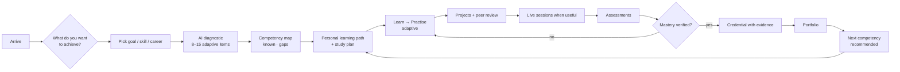
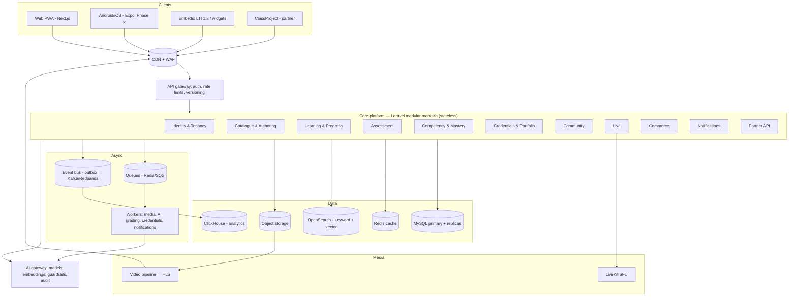
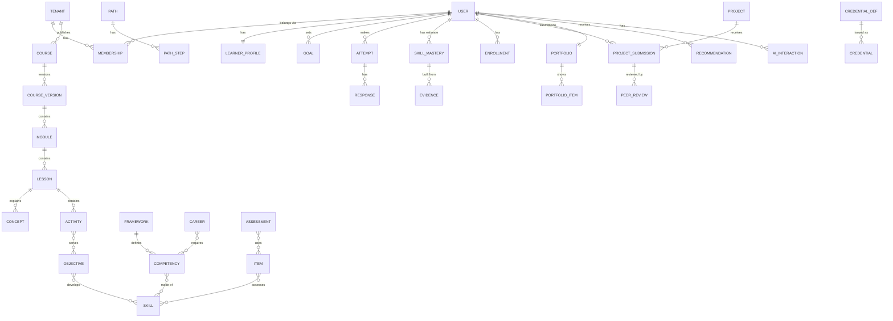
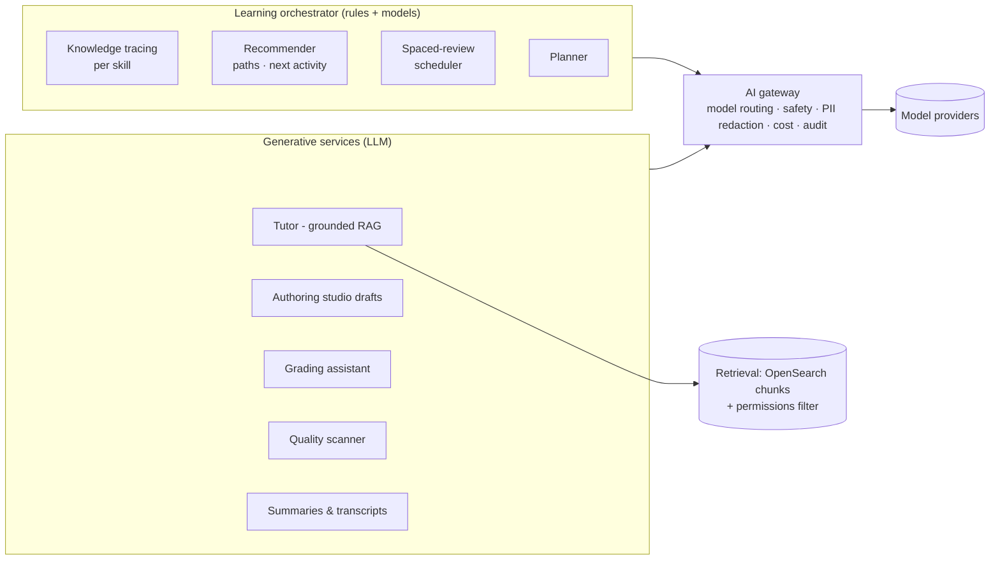
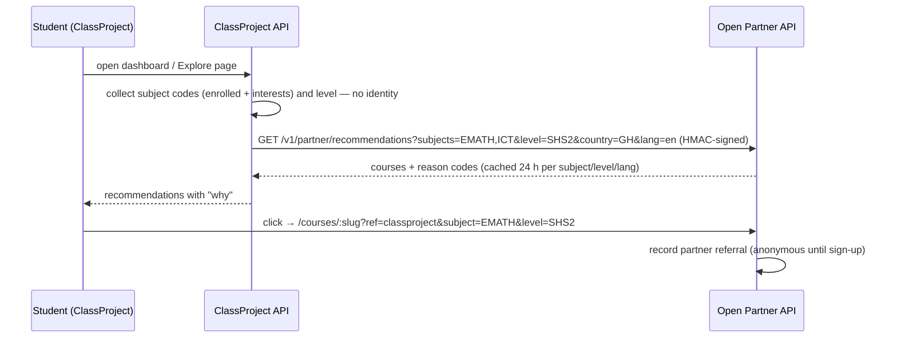

# ClassProject Open — Global MOOC Platform
## Product Requirements & Architecture Specification

> **Working name:** *ClassProject Open* (placeholder — rename freely; see section 0.3).
> **Source brief:** [`Master Prompt — Next-Generation Global MOOC Platform.md`](Master%20Prompt%20—%20Next-Generation%20Global%20MOOC%20Platform.md) (the original prompt; references like "brief section 14" point there).
> **Sister product:** ClassProject, the multi-tenant school LMS and virtual classroom in the [cp repository](https://github.com/Techmawu-Solutions/cp) (its spec is `Multi-Tenant LMS & Virtual Classroom — Frontend Product Specification.md` there). The two are **separate platforms** joined by one narrow link: ClassProject recommends Open courses to students by subject (Section 25).
> **Database:** [`database/schema.sql`](database/schema.sql), explained in [`database/README.md`](database/README.md).

---

# 0. Start Here — Status, Decisions and How to Continue

This section exists so that anyone (a teammate, or a new AI chat) can pick up the work without the conversation that produced it. **Keep it current**: every working session that changes the product updates section 0.1 and adds a Change Log row at the end.

## 0.1 Current status

| Area | State | Where |
|---|---|---|
| Product & architecture spec (the brief's 25 deliverables) | **Draft v1 written — awaiting validation** | this file |
| Database schema | **Draft v1 — 146 tables, 295 foreign keys; loads cleanly on MySQL 8.4 and MariaDB 10.11** | `database/schema.sql` |
| ClassProject → Open recommendation link | **Prototype built in ClassProject** (mock Open catalogue, subject-based recommendations, student interests) | ClassProject spec section 49.2; cp repo `lib/mooc.ts` |
| Clickable prototype (P0) | **Built**: Next.js on mock data, port 3001. 4 personas; onboarding with diagnostic; Today; path and planner; skill map; lesson player with tutor; spaced review; project with peer review; credentials with verification; portfolio; studio; the real signed partner API; interface in English, French, Portuguese and Spanish | `prototype/` (see section 21.1) |
| Open production code (Laravel API, production web) | **Not started**, on purpose. The brief says: *"Do not start implementation until the architecture and product requirements have been validated."* The prototype is how we validate them. | none yet |

**Next step:** the product owner:

1. clicks through the prototype, following the demo script in `prototype/README.md`;
2. reviews this spec, especially section 21 (MVP scope) and section 26 (open questions);
3. records decisions in section 0.3.

Then Phase 1 (Section 22) starts with the backlog in section 23.

## 0.2 How to continue in a new chat

Paste something like:

> In the cpopen repo, read `README.md`, then `ClassProject Open — Product Specification.md` section 0 and the Change Log. Continue from section 0.1 "Next step". Keep the spec, `database/schema.sql` and `database/README.md` in step with every change.

Rules that apply to all work on Open:

1. **Spec first.** Every new requirement is written into this file (in the section it belongs to, plus a Change Log row) before or with the code.
2. **Schema in step.** Any change to what the platform stores updates `database/schema.sql` and `database/README.md` in the same change, and the schema is re-loaded into an empty MySQL/MariaDB database to prove it runs.
3. **Separate platform.** Open never reads ClassProject's database and vice versa. They talk only through the signed partner API in section 25.
4. **Numbering is stable.** Sections keep their numbers; add sub-sections (e.g. Section 12.4) rather than renumbering.

## 0.3 Decision log

Decisions already taken. Change one only by adding a new row that supersedes it.

| # | Decision | Why | Date |
|---|---|---|---|
| D1 | Working name **ClassProject Open**; public web at `open.classproject.com` (placeholder) | Family resemblance with ClassProject; "Open" signals open learning. Rename is a find-and-replace. | Sep 2026 |
| D2 | **Separate platform**: own codebase, own database, own deploy. Linked to ClassProject only by a signed HTTP partner API | Different users (global adults + teens vs. Ghanaian school tenants), different scale, different release cadence | Sep 2026 |
| D3 | **Modular monolith first** (Laravel 12 API + Next.js web), extract services only when scale or team ownership demands it | Brief section 50: "Avoid premature microservices" | Sep 2026 |
| D4 | **MySQL 8 (InnoDB)** as the transactional store; **OpenSearch** for keyword + vector search; **ClickHouse** for analytics; **Redis** for cache/queues; S3-compatible object storage + CDN | Same operational family as ClassProject (MySQL/Laravel); brief section 33 separates transactional, search, analytics, video and AI workloads | Sep 2026 |
| D5 | IDs: `BIGINT` internal keys + **ULID `public_id`** on every object that appears in a URL or API | Internal joins stay fast; public IDs don't leak counts and survive regional sharding | Sep 2026 |
| D6 | Mastery model: evidence-weighted **Bayesian knowledge tracing** per skill, with four visible states **Exposed → Understood → Applied → Verified** | Brief section 5: distinguish "I watched it" / "I understand it" / "I can apply it" | Sep 2026 |
| D7 | Credentials are **Open Badges 3.0 / W3C Verifiable Credentials**, signed, each with a public verification URL | Brief section 10: verifiable evidence; portable, standards-based | Sep 2026 |
| D8 | Learning standards: **xAPI/cmi5** activity records, **SCORM 1.2/2004 import**, **LTI 1.3** (both directions), **QTI 3** item exchange, **CASE** competency frameworks, **OneRoster** for school/SIS sync | Interoperability with institutions; ClassProject is already SCORM-conformant | Sep 2026 |
| D9 | AI through a **provider-agnostic gateway** (Laravel AI SDK) — default Claude models by tier, with failover; embeddings via a dedicated embedding model | Brief section 36/section 45: citations, audit, no lock-in | Sep 2026 |
| D10 | Payments are **provider-agnostic** (Paystack/Flutterwave for African mobile money and cards, Stripe elsewhere) with **country price books** (purchasing-power pricing) | Brief section 17/section 40: don't assume a credit card; no single-country dependency | Sep 2026 |
| D11 | **Offline-first PWA before native apps**; native Android (Expo/React Native) in Phase 6 | Cheapest route to low-end Android + offline; one codebase with the web | Sep 2026 |
| D12 | **Learners under 18 are supported** (ClassProject students are 11–19) with age-aware defaults, guardian consent and no public profile by default | The ClassProject link sends teenagers here | Sep 2026 |
| D13 | ClassProject → Open recommendations send **subject codes and level only, never student identity** | Minors' privacy; ClassProject stays the system of record for school data | Sep 2026 |

---

# 1. Product Vision and Principles

## 1.1 Vision

ClassProject Open is a **global learning operating system**. The primary object is not the course — it is the **learner outcome**:

> "I want to become a data analyst." · "I want to learn artificial intelligence." · "I want to pass WASSCE Elective Mathematics." · "I need to master Python."

For every outcome the platform continuously answers three questions (brief section 55):

1. **What does the learner know?**
2. **What does the learner need to know?**
3. **Can the learner demonstrate that they know it?**

and moves the learner along:

**CURIOUS → KNOWLEDGEABLE → CAPABLE → COMPETENT → VERIFIED**

while the learner keeps ownership of their data, portfolio and credentials.

## 1.2 The learning chain

```text
Outcome → Competencies → Skills → Learning Path → Learning Activities → Practice → Assessment → Evidence → Credential
```

Instead of *Search → Enroll → Watch → Quiz → Certificate*, the core loop is:

```text
Diagnose → Personalise → Learn → Practise → Apply → Collaborate → Demonstrate → Master → Build Evidence → Advance
```

## 1.3 Principles (used to settle design arguments)

| # | Principle | In practice |
|---|---|---|
| P1 | **Competence over consumption** | Progress bars measure mastery, not minutes watched. A certificate is never issued for watching. |
| P2 | **Explain every recommendation** | Every "recommended for you" shows *why* (gap, goal, subject, spaced review). |
| P3 | **Human judgment for high-impact decisions** | AI proposes; humans decide grades that count, credentials, content publication and moderation outcomes. |
| P4 | **Designed for the constrained learner** | Works on a GH₵800 Android phone on 3G with 1 GB/month data, offline for days, paying by mobile money. |
| P5 | **Maximum learning per unit of learner time** | No streak anxiety, no infinite feeds, no dark patterns (Section 25 of brief). |
| P6 | **Evidence is portable** | Portfolio and credentials export in open formats; learner can leave with everything. |
| P7 | **Accessible by architecture** | WCAG 2.2 AA is a release gate, not a later fix. |
| P8 | **Open by default, private by choice** | A meaningful free tier; learners control visibility and personalisation. |
| P9 | **Instructors own their content** | AI never silently edits authoritative content; it flags for review. |

## 1.4 What success looks like (north-star metrics)

The **Learning Effectiveness Index (LEI)** — a transparent composite (Section 19.4):

| Component | Measures | Weight (initial) |
|---|---|---|
| Mastery gain | Skills moved to *Applied* or *Verified* per active learner per month | 30% |
| Retention | Share of mastered skills still recalled at 30/90-day spaced checks | 20% |
| Evidence | Portfolio projects passing rubric; credentials earned with evidence | 20% |
| Path completion | Learning paths completed vs. started (adjusted for learner-set goals) | 15% |
| Learner-reported outcome | "This helped me achieve my goal" (surveyed at goal completion) | 15% |

MAU and time-on-platform are tracked but are **never** targets.

---

# 2. Competitive Gap Analysis

| Platform | Strength we keep | Gap we close |
|---|---|---|
| **Coursera** | Career orientation, university and industry partners, professional certificates | Linear video-first courses; certificates imply competence from completion; weak personalisation; paywalled assessment; poor offline and mobile-money support |
| **edX** | Academic rigour, verified credentials, MicroMasters | Same linear model; little adaptivity; low completion; credentials rarely carry evidence |
| **FutureLearn** | Social learning — conversation beside every step | Discussion is unstructured; no peer calibration; no competency tracking |
| **Udemy** | Instructor marketplace, breadth, low price | Quality varies wildly; star ratings as the only quality signal; no assessment rigour; certificates carry no weight |
| **MIT OCW** | Openness and depth | Static; no learner model, practice, feedback or credential |
| **Khan Academy** | Mastery learning, practice, free | K-12/early-university focus; little career pathing or project evidence |
| **LinkedIn Learning** | Skills tied to jobs | Shallow videos; completion badges only |
| **Moodle/Canvas (LMS)** | Institutional control, standards | Built for teachers administering courses, not for learners pursuing outcomes |

**Our wedge:** outcome-first learning with a live competency graph, evidence-based credentials, and first-class support for low-bandwidth, mobile-money, multilingual learners — starting in West Africa (the ClassProject base), then global.

---

# 3. User Personas

| Persona | Who | Goals | Constraints | Key features |
|---|---|---|---|---|
| **Ama, 16 — secondary student** (arrives from ClassProject) | SHS 2 General Science, Kumasi | Understand Elective Maths, prepare for WASSCE, explore coding | Shared Android phone, prepaid data, school hours; under 18 | Subject-matched recommendations, offline lessons, practice with hints, guardian-consented account, no public profile |
| **Kwesi, 24 — career switcher** | Graduate working in retail, Accra | "Become a data analyst" in 6 months | 5 h/week, evenings, pays by MoMo | Goal-based path, diagnostic, planner, projects, portfolio, verified credential, regional pricing |
| **Priya, 34 — upskilling professional** | Engineer, Bangalore | Master cloud architecture for promotion | Busy; wants to test out of known material | Diagnostic skip, advanced challenges, industry credential |
| **Dr. Mensah — university instructor** | Lecturer, KNUST | Publish a course, reuse materials, see where students struggle | Limited time for authoring | AI studio (human-reviewed), item bank, analytics, live sessions |
| **Efua — independent instructor** | Graphic designer | Earn from teaching | Needs reach and payouts to mobile money | Marketplace, revenue share, quality dashboard |
| **Kofi — mentor** | Senior analyst volunteering | Guide 10 learners | 2 h/week | Assigned learners, feedback queue, office hours |
| **Nana — institution admin** | Continuing-ed office at a university | Run certificate programmes, cohorts, SSO | Compliance, reporting | Institution portal, cohorts, LTI/SIS, credentials |
| **Abena — corporate L&D lead** | Bank HR | Upskill 2,000 staff against a competency framework | Must prove ROI | Private academy, assignments, skills reports, internal certifications |
| **Yaw — employer / verifier** | Hiring manager | Trust a candidate's claim | 2 minutes per candidate | Public portfolio and credential verification page |
| **Platform super admin** | Operator | Healthy tenants, safe content, revenue | Global scale | Tenant, moderation, AI-usage, revenue, system dashboards |

---

# 4. User Journeys

## 4.1 The ideal learner journey (brief section 47)



The learner never reaches *"I finished the course. Now what?"* — the **next competency** card (FR-LP-3) always proposes what comes next, with its reason.

## 4.2 Journey — ClassProject student discovers Open (the link, section 25)

1. Ama opens her ClassProject dashboard. A card **"Go further with ClassProject Open"** shows 3 courses matched to her subjects, each saying why: *"Matches Elective Mathematics — quadratic functions"*.
2. She taps one → ClassProject shows a preview (outline, level, duration, free, data size) → **Open on ClassProject Open**.
3. Open's course page loads with `?ref=classproject&subject=EMATH`. She can preview lessons without an account.
4. To save progress she signs up. Because she's 16, Open asks for a **guardian's phone or email** for consent (Section 6.1.4); until consent arrives she has a limited, private account.
5. Her Open learning never flows back into ClassProject grades (decision D13) — the two records stay separate unless a future, consented integration is added (Section 26).

## 4.3 Journey — career switcher

Kwesi picks *Data Analyst* → diagnostic finds Excel strong, SQL weak, statistics partial → path skips Excel basics, starts SQL → planner fits 5 h/week to a 24-week deadline → misses a week, plan re-flows and tells him the new date → completes 3 portfolio projects with peer + mentor review → earns a *Data Analysis Competency* credential listing each verified skill and linking to the projects → shares his portfolio URL with an employer who verifies it in one click.

## 4.4 Journey — instructor publishes a course

Uploads syllabus and slides to AI Studio → AI proposes outline, objectives mapped to skills, quizzes and a rubric → instructor edits and approves each item (nothing publishes unreviewed) → quality checks run (accessibility, objective coverage, item quality) → submits for review → reviewer approves → course goes live → analytics show a drop-off at lesson 4 and a misconception on item Q17 → instructor revises; the change bumps the course version.

## 4.5 Journey — organisation

L&D lead imports a competency framework (CASE) → creates a private academy with branded subdomain → builds a path per role → assigns to 2,000 staff via SSO groups → tracks skill coverage heat-map → staff earn internal certifications backed by projects.

---

# 5. Information Architecture

## 5.1 Public (no sign-in)

```text
/                       Goal prompt "What do you want to achieve?" + discovery modes
/explore                Goal · Skill · Career · Time · Diagnostic · Curiosity modes
/skills/:slug           Skill page: what it is, paths, courses, jobs that need it
/careers/:slug          Career page: competency map, paths, portfolio requirements
/courses/:slug          Course page with full transparency block (Section 6.15)
/paths/:slug            Learning path page
/institutions/:slug     Institution / organisation profile
/instructors/:slug      Instructor profile
/p/:handle              Public portfolio (learner-controlled)
/verify/:credentialId   Credential verification
/partners/classproject  Landing for arrivals from ClassProject
```

## 5.2 Learner app

```text
Home (today's plan · next best activity · review due)
Goals & Paths          Skills (competency graph)        Courses
Learn player           Practice & Review (spaced)       Projects
Portfolio              Credentials                      Community (groups, cohorts, Q&A)
Live sessions          Planner (calendar)               AI Tutor (in context, not a tab-first chatbot)
Downloads (offline)    Notifications                    Settings (privacy, AI, data export)
```

## 5.3 Other portals

| Portal | Sections |
|---|---|
| **Instructor** | Courses · AI Studio · Item bank · Learners · Assessments & grading · Peer review moderation · Discussions · Live sessions · Analytics · Payouts |
| **Mentor** | Assigned learners · Feedback queue · Sessions · Progress |
| **Institution / Organisation admin** | Users & groups · Instructors · Courses & paths · Cohorts · Competency frameworks · Credentials · Analytics · Integrations (SSO, LTI, SIS) · Branding & domain · Billing |
| **Reviewer** (content quality) | Review queue · Quality flags · Decisions |
| **Platform super admin** | Tenants · Users · Content & moderation · Marketplace & payouts · Revenue · AI usage & cost · Security · System health · Partner integrations (incl. ClassProject) · Settings |

---

# 6. Functional Requirements

Requirement IDs (`FR-<area>-<n>`) are stable and referenced by the backlog (Section 23) and acceptance criteria (Section 24). **Phase** is the build phase from section 22 (P1 = MVP).

## 6.1 Identity, accounts and learner profile

| ID | Requirement | Phase |
|---|---|---|
| FR-ID-1 | Sign up / sign in with email + password, phone + OTP (SMS/WhatsApp), Google, Apple, and institutional SSO (OIDC/SAML) | P1 (SSO P7) |
| FR-ID-2 | MFA (TOTP, passkeys) — required for instructors, admins and anyone with payout or grading rights | P1 |
| FR-ID-3 | One person = one **user**; a user can belong to many tenants (public platform, a university, an employer academy) with a role in each | P1 |
| FR-ID-4 | **Under-18 accounts** (D12): date of birth at sign-up; 13–17 need guardian consent (phone/email link) before community, live or public features; under-13 only through a school/institution tenant; private by default, no direct messages from adults who aren't their instructors/mentors | P1 |
| FR-ID-5 | Rich **learner profile** (brief section 3): education, work history, current role, goals, languages, time availability, device and connectivity profile, accessibility needs, learning preferences | P1 (basic) → P2 |
| FR-ID-6 | Profile never reduces the learner to completion %: the headline is the **competency graph** (Section 15) | P2 |
| FR-ID-7 | Account deletion, data export (JSON + human-readable), per-field visibility controls (Section 6.20) | P1 |

## 6.2 Discovery (brief section 18, section 35)

| ID | Requirement | Phase |
|---|---|---|
| FR-DS-1 | Home asks **"What do you want to achieve?"** — free text understood semantically, plus goal chips | P1 (chips) → P2 (semantic) |
| FR-DS-2 | Six discovery modes: **Goal**, **Skill**, **Career**, **Time** ("I have 20 minutes"), **Diagnostic** ("what next?"), **Curiosity** ("teach me something interesting") | P1: Skill, Time · P2: rest |
| FR-DS-3 | **Semantic search** across courses, lessons, concepts, video transcripts, projects, discussions, documents, instructors and skills; natural-language queries ("two weeks to learn Python for data analysis") return **paths**, not just courses | P2 |
| FR-DS-4 | Every recommendation shows **why** (goal gap, subject match, spaced review, peers with the same goal, partner referral) and can be dismissed ("not interested" trains the recommender) | P1 |
| FR-DS-5 | Filters: language, level, duration, cost (free first), credential type, offline-available, accessibility features, data size | P1 |

## 6.3 Diagnostics and the competency graph

| ID | Requirement | Phase |
|---|---|---|
| FR-DG-1 | Adaptive **diagnostic** per goal: 8–15 items chosen by item difficulty and skill coverage; stops early when confident | P2 |
| FR-DG-2 | Diagnostic produces a **competency map**: each skill *known / partial / gap* with confidence | P2 |
| FR-DG-3 | **Test out**: a learner can take a unit's mastery check up front; passing marks its skills *Verified* and skips the unit | P2 |
| FR-DG-4 | The **learner competency graph** updates from every piece of evidence (practice, quiz, project, peer review, instructor grade, live participation) with source and date (Section 15) | P2 |

## 6.4 Learning paths and the planner

| ID | Requirement | Phase |
|---|---|---|
| FR-LP-1 | Path types: **Course path** (course → course → project → assessment → credential), **Skill path** (skill → skill → competency → project → credential), **Career path** (career → competency map → path → portfolio → assessment → evidence) | P1 (course path) → P2 |
| FR-LP-2 | **Personal path generation** from goal + diagnostic: known material skipped, gaps ordered by prerequisites | P2 |
| FR-LP-3 | **Next best activity** card on Home, always with its reason | P1 (rule-based) → P2 (adaptive) |
| FR-LP-4 | **Planner** (brief section 26): learner gives goal, deadline, hours/week, preferred days → realistic schedule. When the learner falls behind, the plan re-flows and says what changed ("new finish date 12 Mar; or add 1 h/week to keep 28 Feb") | P2 |
| FR-LP-5 | Calendar export (ICS) and reminders at the learner's chosen times | P2 |

## 6.5 Course architecture (brief sections 6–7)

| ID | Requirement | Phase |
|---|---|---|
| FR-CA-1 | Hierarchy **Course → Module → Lesson → Concept → Activity**; every activity shows where it sits and which objective it serves | P1 |
| FR-CA-2 | Activity types: video, interactive video, text, audio, slides, interactive diagram, simulation, coding exercise, virtual lab, case study, scenario, project, discussion prompt, peer review, AI tutoring session, live session, assignment, quiz, exam, reflection, research activity, SCORM/cmi5 package, LTI tool | P1: video, text, audio, slides, quiz, assignment, discussion, SCORM · P2: interactive video, coding, flashcards · P3: project, peer review, labs · P5: live |
| FR-CA-3 | **Every activity maps to ≥1 learning objective; every objective maps to ≥1 skill and ≥1 assessment item.** Publishing is blocked when coverage is incomplete (quality gate section 6.17) | P1 |
| FR-CA-4 | Courses are **versioned**. Enrolled learners stay on their version unless the change is marked "safe to migrate"; the course page shows *last updated* and *version* | P1 |
| FR-CA-5 | Prerequisites (skills or courses) with a "check if I'm ready" mini-diagnostic | P2 |
| FR-CA-6 | Import: SCORM 1.2/2004, cmi5, QTI 3 items, Common Cartridge; export: Common Cartridge, QTI | P2 (import) → P7 (export) |

## 6.6 Learn player and video (brief section 15)

| ID | Requirement | Phase |
|---|---|---|
| FR-VP-1 | Adaptive streaming (HLS) with 144p–1080p renditions and an **audio-only** mode; starts at the lowest bitrate on slow networks | P1 |
| FR-VP-2 | Captions (auto-generated, human-reviewed), multi-language subtitles, full transcript with click-to-seek and search-in-video | P1 (captions + transcript) → P6 (translation) |
| FR-VP-3 | Chapters, bookmarks, time-stamped private notes, playback speed, picture-in-picture, resume position across devices | P1 |
| FR-VP-4 | **In-video questions** placed by instructors at timestamps; answers are evidence for the competency graph. Several per video, each **required** or optional; the video pauses at each, and a forward seek stops at the first required question not yet answered (going back is always free). The same applies to recorded lectures from YouTube. Same rules as ClassProject's interactive video (cp spec section 26.3) | P2 |
| FR-VP-5 | Time-stamped public comments (moderated) | P4 |
| FR-VP-6 | AI summary of each video (human-reviewed before learners see it) | P2 |
| FR-VP-7 | Download for offline (Section 6.19) with data-size shown before download | P1 |

## 6.7 Adaptive learning (brief section 5)

| ID | Requirement | Phase |
|---|---|---|
| FR-AD-1 | Three default flows: **Beginner** (concept → explanation → example → practice → feedback → mastery), **Intermediate** (diagnostic → targeted modules → practice → project), **Advanced** (diagnostic → skip known → challenge → project → assessment) | P2 |
| FR-AD-2 | Difficulty adapts per skill from the knowledge-tracing estimate (Section 14.4) | P2 |
| FR-AD-3 | **Mastery states** shown to learners per skill: *Exposed* ("I watched it"), *Understood* ("I understand it" — passed retrieval practice), *Applied* ("I can apply it" — passed an application task or project), *Verified* (proctored/assessed or instructor-confirmed) | P2 |
| FR-AD-4 | Techniques built in: retrieval practice, spaced repetition, interleaving (mixed practice sets), deliberate practice (targeted weak sub-skills), formative feedback, mastery gating (optional per course) | P2 |

## 6.8 AI learning orchestrator and tutor (brief section 4, section 36)

| ID | Requirement | Phase |
|---|---|---|
| FR-AI-1 | **In-context tutor** on every activity (not a separate chatbot tab): explain, give another example, simplify, translate, quiz me | P2 |
| FR-AI-2 | **Hints before answers**: graded hint ladder (nudge → strategy → worked step); full solutions only after an attempt, and never during graded assessments | P2 |
| FR-AI-3 | **Grounded answers** from course content, approved references, instructor resources and institutional materials (RAG), with **citations** to the exact lesson/page/timestamp. Responses are labelled **Course content**, **AI explanation** or **External knowledge**. No citation is ever fabricated — if nothing supports an answer the tutor says so | P2 |
| FR-AI-4 | **Misconception detection** from wrong-answer patterns → targeted remediation activity | P2 |
| FR-AI-5 | Generates personalised practice questions, revision sessions and flashcards from course-approved sources (learner-facing generated items are marked "AI-generated practice" and never count for credentials) | P2 |
| FR-AI-6 | **Escalation**: repeated confusion, frustration signals, safeguarding keywords, or "talk to a human" → routes to mentor/instructor queue with context | P2 |
| FR-AI-7 | Learners can turn personalisation and AI features off (Section 6.20); the platform stays fully usable without AI | P2 |
| FR-AI-8 | Under-18 tutoring runs a stricter safety profile (no off-topic chat, safeguarding escalation to institution/guardian where configured) | P2 |

## 6.9 Knowledge retention (brief section 27)

| ID | Requirement | Phase |
|---|---|---|
| FR-RT-1 | **Review queue** of due items per learner (spaced repetition, FSRS-style scheduling) mixing skills (interleaving) | P2 |
| FR-RT-2 | Concepts the learner is forgetting are resurfaced automatically, including after course completion ("Keep it fresh — 5 min") | P2 |
| FR-RT-3 | Cumulative assessments at module/path milestones | P2 |

## 6.10 Assessment engine (brief section 11)

| ID | Requirement | Phase |
|---|---|---|
| FR-AS-1 | Item types: MCQ, multiple response, true/false, matching, ordering, fill-in-the-blank, numeric, short answer, essay, coding (auto-graded with test cases), file submission, project submission, oral (audio), video response, practical (checklist-observed), simulation-based, peer-assessed, instructor-assessed, AI-assisted | P1: objective types + file + essay · P2: coding, numeric, audio · P3: project, peer, practical, simulation, video |
| FR-AS-2 | Every item tagged with skill(s), Bloom level (recall → create), difficulty, discrimination and time estimate | P1 (tags) → P2 (psychometrics) |
| FR-AS-3 | **Item bank** per course/tenant with versioning, reuse across courses, QTI 3 import/export | P1 |
| FR-AS-4 | **Adaptive assessments** (computerised adaptive testing) for diagnostics and mastery checks | P2 |
| FR-AS-5 | **AI-assisted grading** of open answers proposes a score and rubric rationale; a human confirms any grade that counts toward a credential | P3 |
| FR-AS-6 | Integrity: randomised item forms, time limits, attempt policies, plagiarism/AI-text similarity signals (advisory only), optional remote proctoring for high-stakes credentials | P3 |
| FR-AS-7 | Accessibility accommodations: extra time, screen-reader-friendly items, alternatives to drag-and-drop | P1 |
| FR-AS-8 | Results update the competency graph with evidence weight by assessment type (Section 15.3) | P2 |

## 6.11 Peer assessment (brief section 12)

| ID | Requirement | Phase |
|---|---|---|
| FR-PR-1 | **Anonymous**, rubric-guided reviews; **≥3 reviewers** per submission; no single peer decides a result | P3 |
| FR-PR-2 | **Calibration**: reviewers first grade instructor-scored samples; calibration accuracy sets reviewer weight | P3 |
| FR-PR-3 | **Reliability scoring** (inter-rater agreement); outlier reviews down-weighted; low-agreement submissions go to instructor moderation | P3 |
| FR-PR-4 | **Reviewer quality** tracked over time; helpful reviewers earn a "trusted reviewer" role | P3 |
| FR-PR-5 | AI explains rubric criteria to reviewers and flags reviews that ignore criteria | P3 |
| FR-PR-6 | **Appeals**: learner can appeal once per submission → instructor/mentor decision, logged | P3 |

## 6.12 Projects (brief section 8)

| ID | Requirement | Phase |
|---|---|---|
| FR-PJ-1 | Project = problem statement, requirements, resources, **milestones**, rubric, submission, peer review, AI feedback, instructor feedback, **revisions**, final assessment | P3 |
| FR-PJ-2 | Individual or **team** projects (teams formed from cohort/study group) with contribution logs | P3 |
| FR-PJ-3 | Submissions: files, links, GitHub repository, hosted notebook, video demo | P3 |
| FR-PJ-4 | Passed projects flow into the portfolio automatically (learner chooses visibility) | P3 |

## 6.13 Portfolio (brief section 9)

| ID | Requirement | Phase |
|---|---|---|
| FR-PF-1 | Portfolio shows projects, skills and competency levels, credentials, badges, assessment highlights, evidence files, publications, research, presentations, capstones | P3 |
| FR-PF-2 | Public URL `open.classproject.com/p/<handle>`; each item's visibility is learner-controlled; under-18 portfolios are never public | P3 |
| FR-PF-3 | **Verifiable**: every project/credential shows "Verified by ClassProject Open" with evidence links; employers verify without an account | P3 |
| FR-PF-4 | Integrations: GitHub (repos, commits), Behance/Dribbble links, ORCID for publications | P3 → P7 |
| FR-PF-5 | Export portfolio as PDF, JSON-LD and a static website bundle | P3 |

## 6.14 Credentials (brief section 10)

| ID | Requirement | Phase |
|---|---|---|
| FR-CR-1 | Types: certificate, microcredential, digital badge, competency credential, skill verification, project verification, assessment-based credential, institution-issued, industry-issued | P1 (certificate on assessment) → P3 |
| FR-CR-2 | Each credential carries: unique ID, verification URL, issuer, date, **skills demonstrated**, assessments completed, projects completed, criteria, expiry (optional), and the evidence links | P1 |
| FR-CR-3 | Issued as **Open Badges 3.0** Verifiable Credentials, cryptographically signed by the issuer's key; downloadable, shareable to LinkedIn, walletable | P3 |
| FR-CR-4 | **Never issued for watching**: credential criteria must include at least one assessment or project; "attendance/participation" certificates are labelled as such | P1 |
| FR-CR-5 | Revocation and reissue with reason; verification page shows current status | P3 |

## 6.15 Trust and transparency (brief section 43)

| ID | Requirement | Phase |
|---|---|---|
| FR-TR-1 | Every course page shows: instructor, institution, learning objectives, difficulty, estimated workload, prerequisites, assessment methods, credential requirements, last updated, content version, **accessibility status** (captions, transcripts, screen-reader tested), languages, offline availability, total download size | P1 |
| FR-TR-3 | **Every course has a 16:9 thumbnail.** An instructor can upload a cover: WebP at 640×360, 25 KB at most, with alt text. Without one, the platform generates a cover from the course subject and topic, as a small SVG (under 1 KB). In data-saver mode only generated covers load. Next to the course title the cover is decorative, so screen readers skip it | P1 |
| FR-TR-2 | Quality signals shown beyond stars: mastery rate, median time to mastery, share of learners who met their goal (shown once n ≥ 50) | P2 |

## 6.16 Social learning and community (brief section 13)

| ID | Requirement | Phase |
|---|---|---|
| FR-SC-1 | Structured spaces: course community, study groups, cohorts, peer learning circles, project teams, regional, professional and interest communities | P4 (course Q&A in P1) |
| FR-SC-2 | Q&A with accepted answers, instructor-endorsed answers, and **AI surfacing of unanswered questions** plus "learners who can help" (based on mastery) | P1 (Q&A) → P4 |
| FR-SC-3 | Study sessions: schedule, host peer sessions (uses live infrastructure), follow experts/instructors | P4 |
| FR-SC-4 | Mentorship: mentors assigned or requested; feedback threads; office hours | P4 |
| FR-SC-5 | Moderation: reporting, keyword/AI pre-screen, moderator queue, under-18 protections (no DMs from non-staff adults) | P1 |

## 6.17 Content quality system (brief section 21, section 23)

| ID | Requirement | Phase |
|---|---|---|
| FR-QA-1 | Quality rubric per course: objective quality, instructional design, accuracy, currency, accessibility, assessment quality, practical relevance, media quality, engagement, completion, mastery, learner outcomes | P2 |
| FR-QA-2 | **Pre-publish gates**: objective↔activity↔assessment coverage, captions on all video, alt text, item quality checks, broken links | P1 |
| FR-QA-3 | **Continuous AI monitoring** flags: outdated content, broken links, suspect answer keys, ambiguous items (low discrimination), duplicates, copyright concerns, accessibility problems, learner confusion hot-spots, low-performing activities. **Flags go to a human queue — AI never edits published content** | P2 |
| FR-QA-4 | Quality dashboards for instructors, reviewers and admins | P2 |

## 6.18 Live learning (brief section 14)

| ID | Requirement | Phase |
|---|---|---|
| FR-LV-1 | Live video/audio, screen share (with audio), chat, polls, breakout rooms, whiteboard, collaborative documents, attendance, recording | P5 |
| FR-LV-2 | Automatic transcription, captions, live translation (P6), **AI session summary**, searchable transcript, extracted questions, follow-up assignments | P5 |
| FR-LV-3 | Live sessions are part of the course record: attendance and in-session polls feed progress and (lightly) the competency graph | P5 |
| FR-LV-4 | Low-bandwidth join: audio-only + slides mode; dial-in (P6) | P5 |

## 6.19 Offline-first (brief section 16)

| ID | Requirement | Phase |
|---|---|---|
| FR-OF-1 | Download lessons, videos (chosen quality), readings, practice sets and **offline-capable assessments** (non-proctored) | P1 (video/reading) → P2 (practice/assessments) |
| FR-OF-2 | Notes, progress and answers recorded offline in the device store and **synced** when online; conflicts resolved per section 7.6 | P1 |
| FR-OF-3 | Smart downloads: "next 3 lessons on Wi-Fi", storage budget, auto-delete completed | P2 |
| FR-OF-4 | Data-saver mode: text-first, images on tap, audio-only video | P1 |

## 6.20 Learner control and privacy (brief section 44)

| ID | Requirement | Phase |
|---|---|---|
| FR-LC-1 | Download all my data; export certificates and portfolio; delete my account (with grace period) | P1 |
| FR-LC-2 | Toggles: personalisation, AI tutor, AI-generated practice, public profile, portfolio visibility per item, notification frequency, data sharing with institutions/employers | P1 → P2 |
| FR-LC-3 | Consent log for every data-sharing grant, revocable | P1 |

## 6.21 Notifications (brief section 42)

| ID | Requirement | Phase |
|---|---|---|
| FR-NT-1 | Channels: in-app, push, email, SMS, WhatsApp (opt-in); digest by default | P1 |
| FR-NT-2 | Kinds: learning reminders, review due, assessment deadlines, live-class reminders, instructor announcements, peer responses, goal deadlines, credential achievements | P1 |
| FR-NT-3 | Frequency controls and quiet hours; the system suppresses notifications when the learner is already on track | P2 |

## 6.22 Instructor AI Studio (brief section 20)

| ID | Requirement | Phase |
|---|---|---|
| FR-ST-1 | Inputs: curriculum, syllabus, objectives, source documents, textbooks (licensed), PDFs, videos, slides | P2 |
| FR-ST-2 | Generates: course structure, lesson plans, objectives, quizzes, assignments, case studies, discussion questions, flashcards, practice exercises, rubrics, revision materials, accessibility metadata (alt text, transcripts) | P2 |
| FR-ST-3 | **Every generated artefact is a draft** that a human must review and approve; provenance ("AI-drafted, approved by X on date") stored | P2 |
| FR-ST-4 | Objective → skill mapping suggestions against the tenant's competency framework | P2 |

## 6.23 Marketplace, publishing and revenue (brief section 22)

| ID | Requirement | Phase |
|---|---|---|
| FR-MK-1 | Publishers: universities, schools, companies, independent instructors, experts, professional bodies, NGOs, governments | P1 (platform + invited instructors) → P7 |
| FR-MK-2 | Instructor verification (identity, credentials, domain expertise) | P1 |
| FR-MK-3 | Review workflow: draft → quality checks → reviewer → published; re-review on major versions | P1 |
| FR-MK-4 | Revenue sharing with configurable splits, monthly payouts to bank or mobile money, statements, tax info | P7 (manual payouts in P1) |
| FR-MK-5 | Content licensing: free/open (CC-BY etc.), paid, institution-only, licensed to other tenants | P7 |

## 6.24 Organisation and institution portals (brief sections 29–30)

| ID | Requirement | Phase |
|---|---|---|
| FR-OR-1 | Tenants: branding, subdomain/custom domain, users and groups, roles, content, analytics, billing, integrations | P1 (branding, users) → P7 |
| FR-OR-2 | Competency frameworks: create or import (CASE), map to platform skills | P2 |
| FR-OR-3 | Private or public academies; assign learning to people/groups with due dates | P2 |
| FR-OR-4 | Track skills across the organisation (heat-maps), assess employees, issue internal certifications | P3 |
| FR-OR-5 | Institutions: academic programmes, faculty management, student cohorts, continuing education, microcredentials | P4 |
| FR-OR-6 | Integrations: SSO (SAML/OIDC), LTI 1.3 provider (embed Open in their LMS) and consumer (embed tools in Open), SIS via OneRoster, public API, webhooks | P7 |

## 6.25 Payments and business model (brief sections 40–41)

| ID | Requirement | Phase |
|---|---|---|
| FR-PY-1 | Models: free courses (meaningful free tier: all learning content of free courses incl. practice), premium courses, subscription, professional certificates, microcredentials, institutional licences, corporate seats, cohort-based programmes, marketplace revenue share | P1 (free + one-time + certificate fee) → P2 (subscription) → P7 |
| FR-PY-2 | **Regional pricing** by country price book; local currency display and charging | P1 |
| FR-PY-3 | Methods: cards, mobile money (MTN, Telecel, AirtelTigo, M-Pesa…), bank transfer, vouchers/scholarship codes, invoiced institutional billing | P1 (Paystack + Stripe) → P6 |
| FR-PY-4 | Scholarships and financial aid applications with admin review | P2 |
| FR-PY-5 | Refunds, receipts, tax (VAT) by jurisdiction | P1 |

## 6.26 Administration (brief section 48)

Dashboards per role as listed in section 5.3. Super admin additionally sees **AI usage and cost** per tenant/feature, **security** events, and **moderation** queues.

## 6.27 ClassProject partner link

See **section 25** — the full requirement set for recommendations to ClassProject students.

---

# 7. Non-Functional Requirements

## 7.1 Performance targets (brief section 52)

Measured at p75 on a **reference device**: Android Go phone (2 GB RAM, Chrome), on **"Slow 4G" (1.6 Mbps, 150 ms RTT)** unless stated.

| Metric | Target |
|---|---|
| Home / course page Largest Contentful Paint | ≤ 2.5 s (≤ 4 s on 3G 400 kbps) |
| Interaction to Next Paint | ≤ 200 ms |
| JS shipped on first load (learner app) | ≤ 170 KB gzipped |
| API read latency (p95, in-region) | ≤ 200 ms |
| API write latency (p95) | ≤ 400 ms |
| Video start time | ≤ 2 s on Slow 4G; first frame ≤ 4 s on 3G |
| Search response (p95) | ≤ 500 ms keyword, ≤ 1.2 s semantic |
| AI tutor first token | ≤ 1.5 s; full answer typically ≤ 8 s |
| Assessment submission acknowledged | ≤ 1 s (queued offline instantly) |
| Live class join | ≤ 5 s to audio; ≤ 8 s to video |
| Offline sync after reconnect | ≤ 30 s for a day of activity |

## 7.2 Availability and resilience

- 99.9% monthly availability for learning and assessment; 99.5% for AI features (degrade gracefully: the platform works without AI).
- RPO ≤ 5 min, RTO ≤ 1 h per region; daily restore drills on a sample.
- Multi-AZ from Phase 1; multi-region active-passive in Phase 6, active-active by home region later (Section 17.4).

## 7.3 Scalability

Design point: **10 M registered learners, 500 k concurrently active, 50 k concurrent in live sessions, 5 k video streams starting per second at peak** (exam seasons). Stateless app nodes scale horizontally; heavy reads go to replicas and caches; events are processed asynchronously (Section 8.4).

## 7.4 Accessibility (brief section 38)

WCAG 2.2 AA as a **release gate** (automated axe checks in CI + manual screen-reader passes on key flows). Keyboard navigation, screen readers (NVDA, VoiceOver, TalkBack), captions, audio descriptions, transcripts, high contrast, text resize to 200%, reduced motion, accessible assessments and documents (tagged PDFs, EPUB).

## 7.5 Localisation (brief section 17)

- UI strings in ICU MessageFormat. Launch languages: **English, French, Portuguese and Spanish** (brought forward from P6 so Open matches ClassProject, whose interface already has all four). Then **Twi, Ewe, Hausa, Swahili, Arabic (RTL) and Hindi**.
- A language button (translate icon plus the language code) sits in the header of every page. The menu names each language in that language. The choice applies at once and sets the page's `lang` attribute. It is stored as `users.locale` for signed-in learners and per browser for visitors. It is independent of the languages a learner studies in (`learner_languages`) and a course's own languages (`course_languages`).
- **Translated:** everything the platform itself writes, including mastery states, levels, dates and relative times.
- **Course content in the learner's language:** course, lesson, skill, career and project text, practice questions, video transcripts and readings. In production this is translated per course version (`course_languages`, reviewed by the instructor). The interface picks the version in the learner's language and falls back to the course's primary language.
- **Never translated:**
  - people's and institutions' names;
  - learners' own posts, notes and project work;
  - code (SQL, Python and spreadsheet formulas stay as typed, though comments and printed messages are translated);
  - brand names (ClassProject, ClassProject Open, WASSCE, BECE).
- RTL layouts via logical CSS properties from day one.
- Locale-aware dates, numbers, currencies; time zones stored as UTC + IANA zone.
- Regional content, local instructors and local credentials supported through tenant and catalogue metadata.

## 7.6 Offline sync model

- Device keeps an **event log** (IndexedDB in the PWA, SQLite in native) of learner actions: progress, answers, notes, bookmarks.
- Sync sends events with client timestamps and a device ID; the server applies them idempotently (`client_event_id`).
- Conflict rules: notes = last-writer-wins per note with history; progress = union (never loses completion); answers = first submission wins for graded items, all kept for practice.
- Offline assessments are signed packages with expiry; results sync and are validated (time window, integrity checks) before counting.

## 7.7 Security & privacy

See section 18. Compliance targets: **GDPR**, **Ghana Data Protection Act 2012 (Act 843)**, **Nigeria NDPA 2023**, **Kenya DPA 2019**, **COPPA** (US under-13), **FERPA** considerations for US institutions, **SOC 2 Type II** by end of Phase 6.

---

# 8. System Architecture

## 8.1 Overview



## 8.2 Modules (bounded contexts)

Each module owns its tables (grouped by section in `database/schema.sql`, section 11), exposes an internal service interface, and publishes domain events. Modules never write another module's tables.

| Module | Owns | Publishes (examples) |
|---|---|---|
| **Identity & Tenancy** | users, tenants, memberships, roles, consents, guardians | `UserRegistered`, `ConsentGranted` |
| **Catalogue & Authoring** | courses, versions, modules, lessons, activities, objectives, media assets, reviews | `CoursePublished`, `CourseVersioned` |
| **Competency & Mastery** | frameworks, skills, competencies, careers, learner mastery, evidence | `MasteryChanged`, `SkillVerified` |
| **Learning & Progress** | enrollments, paths, plans, progress, notes, bookmarks, offline sync, review queue | `ActivityCompleted`, `PathCompleted` |
| **Assessment** | item bank, assessments, attempts, responses, grading, peer review, rubrics | `AttemptSubmitted`, `GradeFinalised` |
| **Projects, Portfolio & Credentials** | projects, submissions, portfolios, credential definitions, issued credentials, keys | `ProjectPassed`, `CredentialIssued` |
| **Community** | spaces, groups, cohorts, threads, posts, mentorships, moderation | `QuestionUnanswered`, `ContentReported` |
| **Live** | live sessions, attendance, recordings, transcripts, summaries | `LiveSessionEnded` |
| **Commerce** | products, price books, orders, payments, subscriptions, payouts, scholarships | `OrderPaid`, `SubscriptionRenewed` |
| **Notifications** | preferences, deliveries, digests | — |
| **AI** | AI interactions, prompts, retrieval indexes metadata, generation drafts, quality flags | `AIFlagRaised` |
| **Partner API** | API clients, subject mappings, referrals | `PartnerReferralRecorded` |

## 8.3 Technology choices

| Layer | Choice | Notes |
|---|---|---|
| Web | **Next.js (App Router) + React + TypeScript + Tailwind**, PWA with service worker | Same family as ClassProject; RSC for fast first paint on slow devices |
| Mobile | PWA (P1–P5), **Expo/React Native** Android-first (P6) | Shared API client & design tokens |
| API | **Laravel 12** (PHP 8.4), Octane (RoadRunner/FrankenPHP) for throughput | Modules under `app/Modules/*` |
| Auth | OAuth 2.1 / OIDC server (Laravel Passport), passkeys, SAML bridge | Tenant-aware tokens |
| Primary DB | **MySQL 8.0** (InnoDB), ProxySQL for read/write split | Partitioned high-volume tables (Section 11.4) |
| Cache/queues | **Redis** (cache, sessions, rate limits), queues on Redis → SQS at scale; **Laravel Horizon** | |
| Event bus | Transactional **outbox** table → **Redpanda/Kafka** (Phase 2+) | Analytics, notifications, AI jobs |
| Search | **OpenSearch** (BM25 + k-NN vectors, hybrid ranking) | One index family per content type |
| Analytics | **ClickHouse**; dbt for models; Metabase/Superset for internal BI | xAPI statements land here too |
| Object storage | S3-compatible (AWS S3 / Cloudflare R2) | Signed URLs only |
| Video | Managed pipeline (Mux or Cloudflare Stream) at launch; self-managed FFmpeg→HLS/CMAF + CDN when cost justifies | 13 |
| Live | **LiveKit** (same as ClassProject) with egress for recording + transcription | 13.3 |
| AI | Laravel AI SDK gateway; Claude models by tier; embeddings via Voyage (multilingual) | 12 |
| Infra | Terraform, Kubernetes (EKS/GKE) or Laravel Cloud for early phases; GitHub Actions CI/CD; feature flags (Laravel Pennant) | |
| Observability | OpenTelemetry → Grafana (Tempo, Loki, Mimir), Sentry for errors, synthetic checks from African and global PoPs | |

## 8.4 Asynchronous events (brief section 32)

Everything below is async via queue/event: progress aggregation, analytics, notifications, certificate/credential issuing, video processing, AI jobs (embedding, generation, grading assistance, quality scans), assessment scoring of heavy items (code runs), search indexing, partner referral attribution.

---

# 9. Domain Model

## 9.1 Core entities and relationships



## 9.2 Key definitions

| Term | Definition |
|---|---|
| **Outcome / Goal** | What the learner wants (a career, a skill, an exam, a competency). Owns a target set of skills and an optional deadline. |
| **Framework** | A named, versioned competency framework (platform, national curriculum, industry, employer). Importable via CASE. |
| **Competency** | A capability in a framework (e.g. "Analyse data with SQL"), composed of skills, with proficiency levels. |
| **Skill** | The atomic unit of the competency graph (e.g. "Write SQL joins"). Has prerequisites (a DAG). |
| **Objective** | A course-level learning objective, written by the instructor, mapped to skills. Replaces ClassProject's "learning outcomes/indicators" at this scale. |
| **Concept** | A named idea taught in a lesson; used for search, spaced review and "where this fits". |
| **Activity** | Any learner-facing unit (video, practice, lab…). Maps to objectives. |
| **Evidence** | A dated, sourced observation about a learner's skill (item response, project rubric score, peer review, instructor rating). |
| **Mastery** | The platform's current estimate per learner × skill: probability + state (Exposed/Understood/Applied/Verified) + confidence. |

---

# 10. API Architecture

## 10.1 Style

- **REST, JSON, versioned by path** (`/v1/...`), resource-oriented, cursor pagination, ETags, idempotency keys on all POSTs that create or pay.
- **GraphQL** (read-only, P2) for the learner app's composite screens (Home, Course page) to cut round-trips on slow networks.
- **Webhooks** (signed) for tenants and partners; **Server-Sent Events** for AI streaming and live notifications.
- OpenAPI 3.1 spec is the contract; SDKs generated for TypeScript and PHP.

## 10.2 Surface (selected)

| Area | Endpoints (examples) |
|---|---|
| Auth | `POST /v1/auth/sign-up`, `/sign-in`, `/otp`, `/token`, `/passkeys`; OIDC discovery |
| Profile | `GET/PATCH /v1/me`, `/me/profile`, `/me/consents`, `/me/export`, `DELETE /v1/me` |
| Discovery | `GET /v1/search?q=`, `/v1/discover/{mode}`, `/v1/recommendations` |
| Catalogue | `GET /v1/courses/{id}`, `/v1/paths/{id}`, `/v1/skills/{id}`, `/v1/careers/{id}` |
| Learning | `POST /v1/enrollments`, `GET /v1/me/home`, `POST /v1/activities/{id}/events`, `POST /v1/sync` (offline batch) |
| Assessment | `POST /v1/assessments/{id}/attempts`, `PUT /attempts/{id}/responses/{item}`, `POST /attempts/{id}/submit` |
| Mastery | `GET /v1/me/skills`, `GET /v1/me/skills/{id}/evidence` |
| Projects | `POST /v1/projects/{id}/submissions`, `/submissions/{id}/reviews`, `/appeals` |
| Credentials | `GET /v1/me/credentials`, **public** `GET /v1/verify/{credentialId}` (JSON-LD) |
| AI | `POST /v1/tutor/sessions`, `POST /v1/tutor/sessions/{id}/messages` (SSE stream) |
| Commerce | `GET /v1/prices?country=`, `POST /v1/checkout`, provider webhooks `/v1/webhooks/{provider}` |
| Tenant admin | `/v1/tenants/{id}/users`, `/groups`, `/assignments`, `/frameworks`, `/reports` |
| **Partner** | `GET /v1/partner/recommendations` (Section 25), `POST /v1/partner/referrals` |
| Standards | `/lti/1.3/*` (launch, deep linking, AGS, NRPS), `/xapi/*` (LRS), `/oneroster/*` |

## 10.3 Rate limits and security

Per-token and per-IP limits (Redis sliding window); stricter on auth, AI and search; partner clients have their own quotas. All endpoints tenant-scoped by token claims (Section 17).

---

# 11. Database Architecture

The full DDL is in **[`database/schema.sql`](database/schema.sql)**; the README explains every table group. Principles:

## 11.1 Stores and what goes where

| Store | Holds | Why |
|---|---|---|
| **MySQL 8** (transactional) | Everything in the schema file: users, tenants, catalogue, enrollments, attempts, mastery (current state), credentials, commerce, community | ACID, relational integrity, the team's existing expertise |
| **OpenSearch** | Search documents + vector embeddings of courses, lessons, transcripts, concepts, discussions, skills; RAG chunks | Hybrid keyword/semantic search at scale — kept out of MySQL |
| **ClickHouse** | Raw learning events and xAPI statements, video heartbeats, AI usage, analytics marts | Billions of rows; columnar aggregates for dashboards and LEI |
| **Redis** | Sessions, caches (home feed, course pages), rate limits, queues, live presence | Low latency |
| **Object storage** | Media, uploads, submissions, credential PDFs, exports, offline packages | Cheap, CDN-fronted |

## 11.2 Keys and IDs

`id BIGINT UNSIGNED` internal PKs; **`public_id CHAR(26)` ULID** on all externally referenced rows (D5). Credentials also have a human-friendly `verification_code`.

## 11.3 Tenancy

Every tenant-owned row has `tenant_id`. The **public platform is tenant #1** ("ClassProject Open public"); institutions and organisations are further tenants. Global objects (users, the platform skill taxonomy, careers) have no `tenant_id` or allow NULL. Row access is enforced in the repository layer (global scopes) **and** checked by automated tests that attempt cross-tenant reads (Section 17).

## 11.4 High-volume tables

The append-only logs `activity_events`, `evidence`, `ai_messages`, `notification_deliveries` and `outbox_events` are **range-partitioned by month** and archived to ClickHouse after 90 days. InnoDB doesn't allow foreign keys on partitioned tables, so these carry indexed ids and the application enforces integrity; a monthly job adds next month's partition. Hot aggregates (`progress`, `skill_mastery`) are kept current by workers from these streams.

## 11.5 Scaling path

1. Single primary + read replicas (P1–P3).
2. Functional split: analytics → ClickHouse, search → OpenSearch (already from P2).
3. **Shard by home region** (P6): each region has its own MySQL cluster for learners whose home region it is; global catalogue replicated read-only to all regions; cross-region learners are rare and served via their home region.
4. Very large enterprise tenants can be given a **dedicated database** with the same schema.

---

# 12. AI Architecture

## 12.1 Components



The orchestrator is **mostly deterministic and statistical** (knowledge tracing, scheduling, rule-based pathing); LLMs are used for language tasks. This keeps high-impact decisions explainable (brief section 45).

## 12.2 Model tiers (configurable per feature in `ai_model_configs`)

| Tier | Used for | Default model |
|---|---|---|
| Fast | Classification, moderation pre-screen, hint ladder, short explanations | Claude Haiku 4.5 (`claude-haiku-4-5-20251001`) |
| Standard | Tutor conversations, summaries, grading assistance, quality scans | Claude Sonnet 5 (`claude-sonnet-5`) |
| Deep | Authoring studio (course structures, rubrics), complex reasoning | Claude Opus 5.5 (`claude-opus-5-5`) |
| Embeddings | Search + RAG | Multilingual embedding model (e.g. Voyage multilingual) |

Failover to a second provider per tier via the gateway. Model choices are data, not code.

## 12.3 Grounding and citations (brief section 36)

1. Content is chunked (by lesson section, transcript segment ≤ 60 s, document page) with metadata: tenant, course version, visibility, language, source URL/timestamp.
2. Retrieval filters by **what the learner is allowed to see** (enrolled course, public content, tenant) before ranking.
3. The model must cite chunk IDs; the gateway **verifies every cited ID exists in the retrieved set** and strips any that don't. If no chunk supports the answer, the tutor answers "I can't find this in your course materials" and may offer a clearly labelled *AI explanation* or *External knowledge*.
4. Each answer is labelled **Course content / AI explanation / External knowledge** in the UI.

## 12.4 Safety, privacy and audit (brief section 45)

- PII redaction before prompts where not needed; no training on learner data by providers (contractual zero-retention where offered).
- Safety profiles: *adult*, *under-18* (stricter topics, safeguarding escalation), *assessment mode* (no answers).
- Every AI interaction is logged (`ai_interactions`, `ai_messages`) with model, prompt version, retrieved sources, tokens, cost, latency, and any flags — retained per policy, visible to the learner in their data export.
- **Human in the loop** for: publishing AI-drafted content, grades that count toward credentials, credential issuance, moderation actions, and any account-level sanction.
- Fairness: recommendation and grading-assistant outputs audited quarterly for disparities by language, region, gender and age band; findings published internally.

## 12.5 Evaluation

Offline eval sets per feature (tutor faithfulness, citation precision, hint quality, grading agreement with humans ≥ 0.8 QWK before enabling), online A/B via feature flags with learning-outcome metrics (not engagement) as the primary success measure.

## 12.6 Cost control

Per-tenant and per-learner token budgets, response caching for identical grounded questions per course version, fast-tier routing first, and AI usage dashboards for super admin (Section 6.26).

---

# 13. Video and Live Architecture

## 13.1 Video on demand (brief section 34)

```text
Instructor upload → object storage (resumable, tus)
  → processing (transcode to CMAF/HLS ladder 144p–1080p + audio-only; thumbnails; loudness)
  → captions (speech-to-text, human review queue) → transcript chunks → search + RAG index
  → CDN (signed, short-lived URLs; token-bound for paid content)
  → player (hls.js / native), starts at lowest rung on slow networks, ABR
```

- **Offline downloads**: a chosen rendition packaged per device with a licence expiry (DRM only for content whose licence requires it — Widevine L3 on Android via the native app).
- Heartbeats every 15 s (batched) feed resume position and "Exposed" evidence; never used alone for mastery.

## 13.2 Interactive video

In-video questions stored as timestamped activity items; the player pauses, renders the item, records the response as evidence, and resumes.

## 13.3 Live

```text
Instructor → LiveKit SFU (region nearest the cohort) → learners (WebRTC; audio-only fallback)
            → egress: composite recording → object storage → VOD pipeline
            → live transcription stream → captions + translation (P6) → transcript + AI summary after session
```

Shared with ClassProject's design choices (LiveKit, screen share with audio, whiteboard, breakouts, attendance by stretches). Recordings become course activities; AI summary and extracted questions are drafts the instructor approves.

---

# 14. Assessment Architecture

## 14.1 Objects

`items` (versioned, in an item bank) → `assessments` (a blueprint: fixed list, random pools, or adaptive) → `attempts` → `item_responses` → `grades` (+ `rubric_scores`, `peer_reviews`) → **evidence** for the competency graph.

## 14.2 Scoring

- Objective items auto-scored synchronously; code items run in a sandbox worker (containers with CPU/time limits, no network).
- Open items: human grading, optionally AI-assisted (proposal + rationale), final score by a human for credential-bearing work.
- Partial credit rules per type (multi-response, ordering, matching).

## 14.3 Psychometrics

Item statistics recomputed nightly: p-value (difficulty), point-biserial (discrimination), distractor analysis, time. Items with discrimination < 0.15 or suspicious distractors raise quality flags (FR-QA-3). Adaptive tests use a **2PL IRT** calibration once an item has ≥ 200 responses; before that, instructor-set difficulty.

## 14.4 Knowledge tracing (mastery estimate)

Per learner × skill: Bayesian Knowledge Tracing with parameters per skill (prior, learn, slip, guess), updated by each evidence event weighted by source (Section 15.3) and decayed over time by the forgetting curve used by the review scheduler. The state machine:

| State | Entered when |
|---|---|
| **Not started** | No evidence |
| **Exposed** | Consumed instruction (video watched ≥ 80%, reading completed) |
| **Understood** | P(mastery) ≥ 0.7 from retrieval-practice or quiz evidence |
| **Applied** | Passed an application task, lab, coding exercise or project criterion mapped to the skill |
| **Verified** | Passed a proctored/credential assessment or instructor-confirmed rubric criterion; decays to *Applied* if not refreshed within the skill's refresh period (e.g. 18 months for fast-moving tech skills) |

## 14.5 Integrity

Randomised forms, item exposure control, attempt limits, time windows, IP/device anomaly signals, similarity checks (advisory), optional proctoring (P3). Integrity signals **never auto-fail** a learner; they route to human review.

---

# 15. Competency Model

## 15.1 Structure

```text
Framework (versioned; platform, national curriculum, industry, employer)
 └─ Competency (proficiency levels 1–5 with descriptors)
     └─ Skill (atomic; prerequisites form a DAG; alignments to other frameworks)
          ├─ Objectives (course level) → Activities
          └─ Items / rubric criteria (assessment)
Career ──requires──> Competencies at levels
Job skill (market signal) ──maps to──> Skills
```

## 15.2 Seed frameworks

1. **Platform skill taxonomy** (curated; aligned to ESCO/O*NET where possible).
2. **Ghana SHS curriculum (GES/NaCCA)** subjects and strands — used to match ClassProject subjects (Section 25) and WASSCE prep paths.
3. Industry frameworks via partnerships (e.g. cloud, data, digital marketing).

## 15.3 Evidence weights (initial, tunable)

| Evidence source | Weight | Can reach state |
|---|---|---|
| Video/reading completion | 0 (exposure only) | Exposed |
| AI-generated practice | 0.3 | Understood (never Verified) |
| Instructor-authored practice / quiz | 0.6 | Understood |
| In-video question | 0.4 | Understood |
| Lab / coding exercise / application task | 0.8 | Applied |
| Project rubric criterion (peer, calibrated) | 0.8 | Applied |
| Project rubric criterion (instructor) | 1.0 | Verified |
| Proctored or credential assessment | 1.0 | Verified |
| Live-session participation (poll correct) | 0.2 | Understood |

## 15.4 Learner-facing view

A **skill map** (graph grouped by competency) coloured by state, each node showing *why* (latest evidence, date, source) and *what next* (the activity that moves it forward). Learners can dispute evidence (e.g. "this was a shared device") — raises a review.

---

# 16. Credential Model

| Field | Content |
|---|---|
| `credential_definitions` | Issuer (tenant), type, name, description, **criteria** (required skills at states, required assessments/projects, min scores), validity period, image, alignment to frameworks |
| `credentials` (issued) | Recipient, definition, issued/expiry dates, **public_id** + `verification_code`, evidence (links to attempts, projects, rubric scores), status (active, revoked, expired), signed VC JSON (Open Badges 3.0), revocation reason |
| `issuer_keys` | Per-issuer signing keys (Ed25519), rotation dates, `did:web` identifier |

Verification page `/verify/{code}` shows the credential, the issuer, the skills with evidence summaries, current status, and a machine-readable JSON-LD endpoint. Issuance is **event-driven** (criteria met → pending issuance → human approval if the definition requires it → signed → notified).

---

# 17. Multi-Tenancy Model

## 17.1 Tenant kinds

`platform` (the public Open — tenant #1) · `university` · `school` · `corporate` · `government` · `ngo` · `publisher` (instructor/company storefront).

## 17.2 Isolation

- **Shared database, tenant column** (`tenant_id`) with enforced global scopes; every query path covered by automated cross-tenant tests.
- Users are **global**; a **membership** (user × tenant × role) grants access. A learner's personal data (profile, mastery, portfolio) belongs to the learner, and tenants see it only through explicit **data-sharing consents** (e.g. an employer sees skill reports of assigned learning; a university sees its own course records).
- Content is tenant-owned; licences allow sharing to other tenants or the public catalogue.
- Per-tenant: branding, subdomain/custom domain (TLS via ACME), SSO config, roles & permissions, feature flags, AI budget, billing.

## 17.3 RBAC + ABAC

Roles per tenant (learner, instructor, TA, mentor, reviewer, tenant admin, analyst, billing admin; platform super admin/moderator/support). Attributes refine access: course staff only for their courses; mentors only for assigned learners; under-18 protections; data-sharing consents.

## 17.4 Data residency

Tenant and learner **home region** fields; regional clusters in Phase 6 (Section 11.5). EU tenants' data stays in EU region, etc.

---

# 18. Security Architecture

| Control | Implementation |
|---|---|
| Authentication | OAuth 2.1/OIDC, passkeys, TOTP MFA, phone OTP with SIM-swap risk checks; enterprise SSO (SAML/OIDC) |
| Authorisation | RBAC + ABAC policies (Laravel policies), tenant scoping, deny-by-default |
| Data protection | TLS 1.3 everywhere; AES-256 at rest; field-level encryption for sensitive PII (DOB, guardian contacts, national IDs); secrets in a vault |
| Media | Short-lived signed URLs, token-bound playback, hotlink protection |
| API | Gateway rate limits, WAF, bot management on sign-up/checkout, request signing for partners (HMAC, section 25) |
| Credentials | Signed VCs, key rotation, revocation list, verification rate-limited |
| Fraud | Payment fraud scoring, account-sharing and assessment-fraud signals (advisory, human review) |
| Audit | Append-only `audit_logs` for admin, grading, credential, consent and AI-policy actions |
| Privacy | Consent records, data export/deletion pipelines, retention schedules, DPIAs for AI and minors |
| Minors | Guardian consent, no public profiles, DM restrictions, safeguarding escalation paths, age-appropriate content flags |
| AppSec | SAST/DAST in CI, dependency scanning, annual pen-test, bug bounty (P6) |

---

# 19. Analytics Architecture

## 19.1 Pipeline

```text
App → outbox_events (MySQL) → Kafka/Redpanda → ClickHouse (raw) → dbt marts → dashboards / API
Device heartbeats & xAPI → ingestion endpoint → ClickHouse
```

## 19.2 Event taxonomy (examples)

`activity.started/completed`, `video.heartbeat`, `item.responded`, `attempt.submitted`, `mastery.changed`, `review.due/completed`, `project.submitted/reviewed`, `credential.issued`, `recommendation.shown/clicked/dismissed` (with reason code), `tutor.asked/escalated`, `partner.referral` (source=classproject, subject).

## 19.3 Dashboards

- **Learner:** mastery by skill, progress to goal, time, gaps, strengths/weaknesses, assessment performance, retention.
- **Instructor:** lesson effectiveness (mastery delta per activity), drop-off points, item difficulty/discrimination, misconceptions, discussion activity, content performance.
- **Institution/organisation:** enrolment, completion, mastery, credential attainment, skills heat-map, course quality.
- **Platform:** tenants, revenue, AI usage/cost, safety/moderation, system health, LEI.

## 19.4 Learning Effectiveness Index

Computed weekly per course, path, tenant and platform from the components in section 1.4; every dashboard shows the components next to the composite (brief section 53).

---

# 20. UX Architecture

## 20.1 Principles (brief section 51)

Calm, modern, fast, accessible, mobile-first, content-focused, low cognitive load, personalised, responsive. **Distinct identity** — not Coursera: warm off-white canvas, deep ink text, one confident accent per tenant, generous type, illustration from African and global creators, motion only when it explains.

## 20.2 Key screens

| Screen | Purpose | Notes |
|---|---|---|
| **Goal prompt** | "What do you want to achieve?" | Free text + chips; no catalogue wall |
| **Home — Today** | One next best activity, review due, plan progress, live today | Everything explains *why* |
| **Skill map** | The learner's competency graph | Accessible list view equivalent |
| **Path view** | Steps with states; where you are | Shows time-to-goal honestly |
| **Learn player** | Activity + context rail (objective, concept, where it fits) + tutor | Data-saver toggle visible |
| **Practice/Review** | Interleaved, spaced items with hints | 5-minute sessions |
| **Project workspace** | Brief, milestones, submission, reviews, revisions | |
| **Portfolio** | Public/private view toggle | |
| **Credential** | Evidence-first presentation | Verify button |
| **Instructor studio** | Outline canvas, AI drafts panel (review/approve), coverage checker | |

## 20.3 Design system

Tokens (colour, type, spacing, radius, motion) shared across web and native; components built accessible-first (Base UI/React Aria primitives); RTL and 200% text tested per component; dark mode.

---

# 21. MVP Scope (Phase 1)

**MVP promise:** *A learner anywhere, on a cheap phone, can find a course by skill or goal chip, learn offline, practise, pass an assessment, and earn a verifiable certificate — for free or paying by mobile money — and ClassProject students get subject-matched recommendations.*

| In MVP | Out of MVP (later phase) |
|---|---|
| Sign-up (email, phone OTP, Google), MFA for staff, under-18 consent flow | SSO/SAML (P7) |
| Learner profile (basic) + goals (chips) | Semantic goal understanding (P2) |
| Catalogue, course page with full transparency block | Careers pages (P2) |
| Course player: video (HLS, audio-only), text, audio, slides, SCORM, quizzes, assignments | Coding, labs, simulations (P2–P3) |
| Objective → skill mapping and coverage gate | Full competency graph UI (P2) |
| Enrolment, progress, notes, bookmarks, resume | Adaptive paths, diagnostics (P2) |
| Offline downloads + sync (PWA) | Offline assessments (P2) |
| Basic assessments (objective + essay/file with instructor grading) | Peer review, projects (P3) |
| Certificates with verification URL (criteria require an assessment) | Open Badges VC signing (P3) |
| Course Q&A with moderation | Communities, cohorts (P4) |
| Instructor dashboard: authoring, grading, basic analytics | AI studio (P2) |
| Admin dashboard: users, courses, review workflow, moderation | Marketplace payouts (P7) |
| Payments: free, one-time purchase, certificate fee; Paystack (MoMo, cards) + Stripe; country price books | Subscriptions (P2), scholarships (P2) |
| Notifications: in-app, email, SMS digest | WhatsApp, push (P2) |
| **Partner API for ClassProject recommendations** (Section 25) | ClassProject SSO (future, section 26) |
| English, French, Portuguese and Spanish UI | More languages (P6) |

**MVP catalogue target:** 60 courses — 30 aligned to Ghana SHS subjects (for the ClassProject link), 30 career-starter courses (digital skills, data, business).

---

## 21.1 Clickable prototype (P0)

`prototype/` is a Next.js app on mock data, like the ClassProject prototype. It exists so the product can be tried before it's built. Run it with `npm run dev` on port 3001. Its README has the demo script and a map from each screen to the requirements above.

**What it shows**
- **The first run:** the goal prompt (free text or chips), then an under-18 guardian-consent step, then a diagnostic spread across the goal's skills, then a personal path that skips what the learner already knows.
- **Today:** one next-best activity, with the reason for it.
- **The planner:** it projects a finish date and offers two ways to re-plan when the learner falls behind (more hours a week, or a later date).
- **The skill map:** four states for each skill, with the evidence behind each one and a way to dispute it.
- **The lesson player:**
  - slides with a timed transcript;
  - chapters, captions and speed control;
  - transcript search and time-stamped notes;
  - in-video questions: markers on the seek bar, and a required question can't be skipped by seeking past it;
  - audio-only data saver;
  - a **recorded lecture** from YouTube played in-app under the lesson video where the lesson has one (SQL lesson 1 and Python lesson 1). The frame keeps the page's origin as referrer, since YouTube refuses embeds without it (error 153).
  - **checkpoint questions on the recorded lecture**: the lecture runs through YouTube's player API with YouTube's own controls hidden, pauses at each checkpoint (5:00 required, then an optional one with **Skip**), and the answers count as in-video-question evidence for the skill.
- **Practice:** a hint ladder (nudge, strategy, worked step) before any answer is shown.
- **The tutor:** it answers only from the course and cites the lesson. Otherwise it says "not in your course". It labels every answer, and escalates to a mentor or on safeguarding words.
- **Review:** spaced and interleaved across skills.
- **Mastery checks:** they gate certificates.
- **The project:** milestones, then three calibrated anonymous peers with reliability-weighted scores, advisory AI feedback, the instructor's decision, and an appeal.
- **Credentials:** issued automatically once their criteria are met. The public verification page includes the Open Badges 3.0-shaped JSON.
- **The portfolio:** public or private, and never public for under-18s.
- **Settings:** privacy and AI switches, data export and account deletion.
- **The instructor studio:** the coverage gate, AI drafts that need approval, and quality flags.
- **Offline and data saver:** simulated.
- **The partner API:** `GET /api/v1/partner/recommendations` really runs, with the HMAC signature check, the refusal of learner identifiers, and the section 25.4 rules.

**Interface language:** the header has a language switch for English, French, Portuguese and Spanish (section 7.5).
- The dictionaries are `prototype/lib/i18n/dict/{fr,pt,es}.json`, keyed by the English text. Sentences built from values use `{0}` slots.
- A runtime translator (`prototype/lib/i18n/dom-translator.ts`) swaps the rendered English and localises dates with `Intl`.
- The demo catalogue is translated too, standing in for translated course versions:
  - course and skill titles, descriptions, careers, projects and rubrics;
  - all 60 practice items with their hints and explanations;
  - video transcripts and slides;
  - the lesson readings, each translated as a whole document before it is rendered (`lib/i18n/use-translated.ts`).
- `node ../scripts/i18n-extract.mjs . --missing`, run from `prototype/`, lists interface strings without a translation.

**Course covers:** generated thumbnails on every course card and course page (FR-TR-3), served from `/thumbnails/<slug>.svg`.

**Content**
- Five fully written flagship courses: Spreadsheets That Think, Statistics in Everyday Life, SQL for Data Analysis, Quadratic Functions Made Visual and Python for Beginners.
- 60 practice items across 20 skills.
- Two careers (Data Analyst and Software Developer), each with a project.
- 26 more courses as outlines, using the same slugs as ClassProject's recommendation list.

**Deliberately simulated**
- The video files, the LLM, the reviewers and instructor, the signing of credentials, and real offline sync.

The mastery model is the real one: Bayesian knowledge tracing with the evidence weights of section 15.3.

# 22. Phase-by-Phase Roadmap

| Phase | Theme | Scope (from brief section 54) | Exit criteria |
|---|---|---|---|
| **P0** | Validation | This spec reviewed; open questions (Section 26) answered; design system + clickable prototype of Home, Course, Player, Certificate; data model sign-off | Product owner sign-off |
| **P1** | Foundation (MVP) | 21 | 5,000 learners, p75 LCP ≤ 2.5 s on reference device, 0 cross-tenant leaks in tests, first certificates verified by an external party |
| **P2** | Learning intelligence | Competency framework, diagnostics, adaptive learning, AI tutor (grounded), spaced repetition, personalised paths, planner, AI studio, semantic search, subscriptions | Tutor citation precision ≥ 0.95; mastery gain measurable vs. P1 cohort |
| **P3** | Evidence | Projects, portfolio, advanced assessments, peer review with calibration, Open Badges 3.0 credentials, skill verification, proctoring option | 1,000 portfolio projects passed; peer-vs-instructor agreement ≥ 0.75 |
| **P4** | Community | Cohorts, communities, mentorship, peer learning circles, structured discussions, study sessions | ≥ 60% of questions answered < 24 h |
| **P5** | Live learning | Live classes, breakouts, interactive sessions, recording, transcription, AI summaries | 95% of joins ≤ 8 s |
| **P6** | Global scale | Multi-region, native Android app, offline assessments at scale, localisation (8+ languages), multi-currency, regional payments, global CDN, SOC 2 | Region failover drill passed; 3 new regions live |
| **P7** | Ecosystem | Institution & instructor marketplace with payouts, employer portal, university integrations (LTI, SIS, SSO), public API, third-party ecosystem | 20 institutional tenants; public API GA |

---

# 23. Engineering Backlog (Phase 0–1 epics)

Each epic lists its stories; IDs trace to FRs. Later phases are expanded when they start (keep this section current).

| Epic | Stories (abridged) | FRs |
|---|---|---|
| **E0 Platform skeleton** | Repos (api, web), CI/CD, environments, IaC, observability, feature flags, OpenAPI pipeline, design tokens | — |
| **E1 Identity** | Email/phone/Google sign-up; OTP via SMS provider; MFA; memberships & roles; under-18 DOB gate + guardian consent; account deletion & export | FR-ID-1..7, FR-LC-1..3 |
| **E2 Tenancy** | Tenant model, global scopes, cross-tenant test harness, branding, subdomains | FR-OR-1 |
| **E3 Catalogue & authoring** | Course/version/module/lesson/activity CRUD; objectives & skill mapping; coverage gate; review workflow; SCORM import; transparency block | FR-CA-1..4, FR-TR-1, FR-MK-2..3, FR-QA-2 |
| **E4 Media** | Upload (tus), managed transcoding, captions pipeline + review, signed playback, player (ABR, audio-only, chapters, notes, resume) | FR-VP-1..3, FR-VP-7 |
| **E5 Learning & progress** | Enrolment, progress events, home "next activity" (rule-based), bookmarks, notes | FR-LP-3, FR-CA-1 |
| **E6 Offline** | Service worker, download manager, IndexedDB event log, `/v1/sync` idempotent batch, data-saver mode | FR-OF-1..2, FR-OF-4 |
| **E7 Assessment (basic)** | Item bank (objective types + essay/file), assessments, attempts, grading UI, accommodations | FR-AS-1..3, FR-AS-7 |
| **E8 Certificates** | Definitions with criteria (must include assessment), issuance, PDF + verification page | FR-CR-1..2, FR-CR-4 |
| **E9 Community (Q&A)** | Course Q&A, accepted answers, reporting, moderation queue, minor protections | FR-SC-2, FR-SC-5 |
| **E10 Commerce** | Products, country price books, checkout (Paystack, Stripe), webhooks, receipts, refunds | FR-PY-1..3, FR-PY-5 |
| **E11 Notifications** | Preferences, in-app, email, SMS digest | FR-NT-1..2 |
| **E12 Dashboards** | Learner, instructor (basic analytics), admin (users, courses, moderation) | 6.26 |
| **E13 Discovery (basic)** | Keyword search (OpenSearch), filters, skill and time modes, recommendation reasons | FR-DS-2, FR-DS-4..5 |
| **E14 Partner API — ClassProject** | API clients + HMAC signing, subject mappings admin, `GET /v1/partner/recommendations`, referral landing + attribution, ClassProject-side cache | 25 |

---

# 24. Acceptance Criteria (MVP highlights)

Written as Given/When/Then; each epic gets the full set when it starts.

| ID | Criterion |
|---|---|
| AC-ID-4 | **Given** a new user with a date of birth making them 15, **when** they finish sign-up, **then** their account is private, community/live/public features are locked, and a consent request is sent to the guardian contact; **when** the guardian approves, **then** those features unlock and the consent is logged. |
| AC-CA-3 | **Given** a course version with an activity not mapped to any objective (or an objective with no assessment item), **when** the instructor submits it for review, **then** submission is blocked and the gaps are listed. |
| AC-VP-1 | **Given** a network throttled to 400 kbps, **when** a learner plays a lesson video, **then** playback starts within 4 s at the lowest rendition and the audio-only option is offered. |
| AC-OF-2 | **Given** a learner completes 3 lessons and writes notes offline, **when** connectivity returns, **then** progress and notes appear on another signed-in device within 30 s, and replaying the sync causes no duplicates. |
| AC-CR-4 | **Given** a credential definition without an assessment or project criterion, **when** an admin tries to publish it, **then** it is rejected with "Credentials must require demonstrated work". |
| AC-CR-2 | **Given** an issued certificate, **when** anyone opens `/verify/{code}` without signing in, **then** they see recipient (as the learner allows), issuer, date, skills demonstrated, assessment completed and status. |
| AC-PY-2 | **Given** a learner in Ghana, **when** they view a premium course, **then** the price is in GHS from the Ghana price book and mobile money is offered first. |
| AC-TN-1 | **Given** two tenants, **when** any API is called with a tenant-A token for a tenant-B resource ID, **then** the response is 404 and the attempt is logged. (Automated for every endpoint.) |
| AC-PT-1 | **Given** a valid ClassProject API client, **when** it requests recommendations for `subjects=EMATH,ICT&level=SHS2&country=GH`, **then** it receives ≤ 12 published, free-or-preview courses suitable for 13–17-year-olds, each with a subject-specific reason, in ≤ 500 ms p95, and no learner identifier is required or accepted. |
| AC-PT-2 | **Given** a request with a bad or expired HMAC signature, **then** the API returns 401 and records the failure. |

---

# 25. ClassProject Integration — Subject-Based Recommendations

The **only** link between the two platforms (decision D2). It is deliberately small, one-directional for data, and privacy-preserving.

## 25.1 What students see (in ClassProject)

- **Student dashboard** card *"Go further with ClassProject Open"* — up to 3 courses matched to the student's subjects.
- **Explore beyond class** page (student menu) — all recommendations, filterable by subject, plus **subject interests**: the student can add subjects they're curious about but don't take (e.g. a General Arts student interested in ICT) or hide subjects.
- Each recommendation shows: title, provider, level, estimated hours, free/paid, offline-available, and **why** ("Because you take Elective Mathematics", "Because you're interested in ICT").
- A preview dialog, then **Open on ClassProject Open** (opens the Open course page in a new tab with referral parameters).
- The Super Administrator can switch recommendations off platform-wide.

## 25.2 Data flow



## 25.3 Contract

**Request** — `GET /v1/partner/recommendations`

| Param | Example | Notes |
|---|---|---|
| `subjects` | `EMATH,ICT,ENG` | ClassProject **catalogue subject codes** (ClassProject spec section 17.1). Stable across schools of one country; ClassProject keeps one catalogue per country, so the same code can mean different subjects in two countries |
| `country` | `GH` | ISO 3166-1 alpha-2 country of the student's school. Optional, default `GH`. The codes in `subjects` are read in this country's catalogue |
| `level` | `SHS2` | `BASIC1`–`BASIC6`, `JHS1`–`JHS3`, `SHS1`–`SHS3` |
| `lang` | `en` | UI language |
| `limit` | `12` | ≤ 24 |

Headers: `X-Partner-Key: <client id>`, `X-Partner-Timestamp: <unix>`, `X-Partner-Signature: HMAC-SHA256(secret, method + path + query + timestamp)`; requests older than 5 minutes are rejected.

**Response**

```json
{
  "generated_at": "2026-09-29T10:00:00Z",
  "items": [
    {
      "id": "01J9ZC3Y7Q8M2F4K6N1P0R5T8V",
      "slug": "quadratic-functions-made-visual",
      "title": "Quadratic Functions, Made Visual",
      "provider": "KNUST Mathematics",
      "level": "beginner",
      "hours": 6,
      "price": { "free": true },
      "offline": true,
      "language": "en",
      "url": "https://open.classproject.com/courses/quadratic-functions-made-visual",
      "thumbnail_url": "https://open.classproject.com/thumbnails/quadratic-functions-made-visual.svg",
      "subjects": ["EMATH", "MATH"],
      "reason": { "code": "subject_match", "subject": "EMATH", "text": "Matches Elective Mathematics — quadratic functions" }
    }
  ]
}
```

## 25.4 Matching rules (Open side)

1. `partner_subject_mappings` maps (`classproject`, country, subject code, level band) → Open **skills/topics** (built on the Ghana SHS framework, section 15.2). A country with no mappings yet gets an empty list rather than guesses; Ghana is mapped today.
2. Candidate courses are those **published**, **suitable for 13–17** (`min_age ≤ 13` or flagged *secondary-friendly*), free or with free preview, in the requested language (fallback English).
3. Rank by: skill overlap with the subject mapping → level fit → curriculum alignment (WASSCE/BECE prep flagged higher) → quality score (mastery rate) → freshness. Diversity: at most 2 courses per subject in the top 6.
4. Each item returns one **reason code**: `subject_match`, `interest_match`, `exam_prep`, `next_level` (goes beyond the syllabus).

## 25.5 Privacy and safety

- No student identifiers, names, schools or grades are sent (D13). Requests carry only subject codes, level and language.
- Referral links carry subject and level only; Open attributes referrals anonymously, and links them to an account only if the learner signs up.
- Sign-up from a referral enforces the under-18 flow (FR-ID-4).
- ClassProject remains the system of record for school learning; Open learning is not reported back to schools unless a future consented integration is designed (Section 26 Q7).

## 25.6 Operations

- Partner client managed by Open super admin (`api_clients`); secret rotation every 12 months.
- ClassProject caches responses 24 h per (subjects, level, lang) — at most a few thousand distinct keys nationally.
- If Open is unreachable, ClassProject shows the last cached list or hides the card; it never blocks the dashboard.
- Metrics: impressions (ClassProject), clicks and sign-ups (Open `partner_referrals`), later: mastery gained by referred learners (aggregate only).

---

# 26. Open Questions (need product-owner decisions)

| # | Question | Default if not answered |
|---|---|---|
| Q1 | Final product name and domain | Keep *ClassProject Open* / `open.classproject.com` |
| Q2 | Launch markets beyond Ghana for P1 | Ghana + Nigeria + Kenya (English), Côte d'Ivoire + Senegal (French) |
| Q3 | Who produces the first 60 courses (in-house, partner universities, commissioned instructors)? | Mix: 20 in-house SHS-aligned, 20 partner, 20 commissioned |
| Q4 | Revenue share split for marketplace instructors | 70% instructor / 30% platform on direct sales; 50/50 on subscription pool |
| Q5 | Is proctoring needed for any P3 credential? | Optional, off by default |
| Q6 | Minimum age for independent (non-school) accounts | 13 with guardian consent; 18 without |
| Q7 | Should Open learning ever flow back into ClassProject (e.g. teachers see a student's Open mastery)? | No, until a consent-based design is approved |
| Q8 | Hosting: Laravel Cloud / managed K8s / VPS for P1 | Managed Kubernetes in a single region (Europe-West or Africa (Cape Town) + CDN PoPs in Accra/Lagos) |
| Q9 | Should ClassProject students get free premium access (sponsored)? | Free courses only; sponsorship as a later programme |

---

# 27. Glossary

| Term | Meaning |
|---|---|
| **Activity** | Any learner-facing unit inside a lesson |
| **BKT** | Bayesian Knowledge Tracing — probability model of skill mastery |
| **CASE** | IMS Competencies and Academic Standards Exchange — framework import/export |
| **cmi5 / xAPI** | Modern activity-tracking standards (successors to SCORM) |
| **Evidence** | A dated, sourced observation about a learner's skill |
| **LEI** | Learning Effectiveness Index (Section 19.4) |
| **LTI 1.3** | Standard for embedding tools between LMSs |
| **OB 3.0 / VC** | Open Badges 3.0 as W3C Verifiable Credentials |
| **Partner API** | The signed API ClassProject uses for recommendations (Section 25) |
| **Price book** | Country-specific price list for a product |
| **Tenant** | An organisation space (the public platform is tenant #1) |

---

# Change Log

| Date | Change | Sections |
|---|---|---|
| Sep 2026 | Specification v1 drafted from the master brief: vision, gap analysis, personas, journeys, IA, functional and non-functional requirements, architecture, domain, API, database, AI, video/live, assessment, competency, credential, tenancy, security, analytics, UX, MVP, roadmap, backlog, acceptance criteria | all |
| Sep 2026 | ClassProject integration: subject-based recommendations via a signed partner API, no student identity shared | section 0.3 D12–D13, section 4.2, section 25 |
| Sep 2026 | Database schema v1 (`database/schema.sql`) | 11 |
| Sep 2026 | Clickable prototype (P0) built in `mooc/prototype/`, with ClassProject's recommendation links opening it in development | 0.1, 21.1, 25 |
| Sep 2026 | Course thumbnails: instructor covers (16:9 WebP, 25 KB at most, with alt text) or a generated SVG cover; partner API returns `thumbnail_url` | 6.15 (FR-TR-3), 21.1, 25.3 |
| Sep 2026 | Interface language switch: English, French, Portuguese, Spanish at launch (Portuguese and Spanish brought forward from P6); authored content is not machine-translated by the interface | 7.5, 21, 21.1 |
| Sep 2026 | The whole page follows the chosen language: course content (lessons, readings, transcripts, practice, careers, projects) is shown in the learner's language as a translated course version, not only the interface | 7.5, 21.1 |
| Oct 2026 | Moved out of the ClassProject repository (`cp/mooc/`) into its own repository, **cpopen**: spec, database, prototype, the original brief and a copy of the translation-check script. Nothing about the product changed | 0 |
| Oct 2026 | Partner API takes `country` (ISO code, default `GH`) because ClassProject now keeps one programme and subject catalogue per country; subject mappings are per country, and an unmapped country gets an empty list | 25.2, 25.3, 25.4, 23 (AC-PT-1) |
| Oct 2026 | Lesson player plays recorded YouTube lectures in-app (`Activity.lecture`, privacy-enhanced domain, referrer kept so YouTube allows playback) | 21.1, 6.6 |
| Oct 2026 | In-video questions (FR-VP-4): several per video, required or optional, markers on the seek bar and no seeking past an unanswered required question; recorded YouTube lectures get checkpoint questions through the YouTube player API, recorded as `video_question` evidence. Schema: `activity_lectures`; `video_questions` can sit on a lecture and gains `position` | 6.6, 21.1 |
