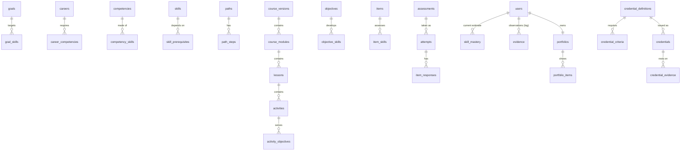

# ClassProject Open: database schema

[`schema.sql`](schema.sql) defines the **transactional database** of ClassProject Open, the global MOOC platform. It is a separate database from ClassProject's (`database/schema.sql` in the [cp repository](https://github.com/Techmawu-Solutions/cp)): the two platforms never share tables. They talk only through the signed partner API (spec section 25).

- **Target:** MySQL 8.0+ in production.
- **Check:** the file is verified by loading it into an empty MariaDB 10.11 database. It creates 146 tables and 295 foreign keys, plus 5 log tables partitioned by month.
- **Load it:**

```bash
mysql -u root -e "CREATE DATABASE classproject_open CHARACTER SET utf8mb4"
mysql -u root classproject_open < database/schema.sql
```

## Keeping it up to date

When a change adds, changes or removes something the platform stores, update all of these in the same change:

1. `schema.sql`: the table, its keys, and a comment on anything not obvious;
2. this README (the table groups below);
3. the spec, [`../ClassProject Open — Product Specification.md`](../ClassProject%20Open%20—%20Product%20Specification.md): the relevant section, section 0.1 status, and a Change Log row.

Then reload the file into an empty database to prove it runs, and drop that database.

## Conventions

| Rule | Why |
|---|---|
| `id BIGINT UNSIGNED` internal keys, plus a **`public_id CHAR(26)` ULID** on anything in a URL or the API | Fast joins; public IDs don't reveal counts and survive regional sharding (decision D5) |
| `tenant_id` on tenant-owned rows. **Tenant 1 is the public platform.** | Strict isolation (spec section 17) |
| **Users are global**: `memberships` give a user a role in a tenant | One person can learn publicly, study at a university, and train at work |
| Times are DATETIME in UTC. Money is `DECIMAL(12,2)` with an ISO-4217 currency | Global from day one |
| Index names: `ix_*` for plain indexes, `uq_*` for unique ones. Foreign keys are unnamed | Avoids name collisions between indexes and foreign keys (a real error on MariaDB) |
| Sensitive personal data (date of birth, guardian contact, payout details) is stored encrypted (`*_enc VARBINARY`) | Privacy of minors and financial data |
| The 5 append-only logs are partitioned by month and have **no foreign keys** | InnoDB doesn't allow foreign keys on partitioned tables; the app enforces integrity. A monthly job adds the next partition |

## Table groups (numbered as in `schema.sql`)

| # | Group | Tables |
|---|---|---|
| 1 | Platform & tenants | `countries`, `tenants`, `tenant_domains`, `tenant_settings`, `sso_connections` |
| 2 | Identity & profile | `users`, `user_identities`, `webauthn_credentials`, `guardian_consents`, `permissions`, `roles`, `role_permissions`, `memberships`, `user_groups`, `user_group_members`, `consents`, `learner_profiles`, `learner_languages`, `learner_history`, `devices` |
| 3 | Competency graph | `frameworks`, `skills`, `skill_prerequisites`, `competencies`, `competency_levels`, `competency_skills`, `careers`, `career_competencies`, `job_skills`, `job_skill_mappings`, `goals`, `goal_skills` |
| 4 | Catalogue & authoring | `instructor_profiles`, `courses`, `course_instructors`, `course_versions`, `course_languages`, `course_prerequisite_skills`, `objectives`, `objective_skills`, `course_modules`, `lessons`, `concepts`, `media_assets`, `media_captions`, `media_chapters`, `activities`, `activity_objectives`, `activity_lectures`, `video_questions`, `course_reviews`, `quality_flags`, `topics`, `course_topics` |
| 5 | Programs & paths | `programs`, `paths`, `path_steps` |
| 6 | Learning & progress | `enrollments`, `path_enrollments`, `activity_progress`, **`activity_events`** (partitioned), `sync_batches`, `notes`, `bookmarks`, `study_plans`, `study_sessions`, `review_items` |
| 7 | Mastery | `skill_mastery`, **`evidence`** (partitioned), `diagnostics` |
| 8 | Assessment | `items`, `item_skills`, `item_statistics`, `rubrics`, `rubric_criteria`, `assessments`, `assessment_items`, `accommodations`, `attempts`, `item_responses`, `code_runs` |
| 9 | Projects & peer review | `projects`, `project_milestones`, `teams`, `team_members`, `project_submissions`, `rubric_scores`, `peer_reviews`, `reviewer_calibrations`, `reviewer_stats`, `appeals` |
| 10 | Portfolio & credentials | `portfolios`, `portfolio_items`, `portfolio_item_skills`, `issuer_keys`, `credential_definitions`, `credential_criteria`, `credentials`, `credential_evidence` |
| 11 | Community | `communities`, `community_members`, `cohorts`, `threads`, `posts`, `post_votes`, `follows`, `mentorships`, `help_requests`, `moderation_reports`, `moderation_actions` |
| 12 | Live | `live_sessions`, `live_attendance`, `live_polls`, `live_poll_answers` |
| 13 | AI | `ai_model_configs`, `ai_interactions`, **`ai_messages`** (partitioned), `ai_drafts`, `recommendations` |
| 14 | Commerce | `products`, `price_books`, `prices`, `vouchers`, `orders`, `order_items`, `payments`, `refunds`, `subscriptions`, `entitlements`, `scholarship_applications`, `payout_accounts`, `revenue_shares`, `payouts` |
| 15 | Notifications | `notification_preferences`, `notifications`, **`notification_deliveries`** (partitioned) |
| 16 | Partner API & integrations | **`api_clients`**, **`partner_subject_mappings`**, **`partner_referrals`**, `lti_registrations`, `lti_links`, `webhook_endpoints`, `learning_assignments` |
| 17 | Audit & data rights | `audit_logs`, `data_requests`, **`outbox_events`** (partitioned) |
| 18 | Reference data | Seeded: 5 price books, 7 countries, tenant 1 (the public platform), 11 system roles, 8 AI model configs, the Ghana SHS curriculum framework (draft) |

## The core chain in tables

The brief's chain, *Outcome → Competencies → Skills → Path → Activities → Practice → Assessment → Evidence → Credential*, maps to tables like this:



- **Mastery flow:** an `item_responses`, `rubric_scores`, `activity_progress` or `live_poll_answers` row produces an **`evidence`** row, weighted by its source (spec section 15.3). A worker then updates **`skill_mastery`**: the probability of mastery and a state of *exposed*, *understood*, *applied* or *verified*.
- **Credentials:** when every `credential_criteria` row is met, a `credentials` row is created as *pending approval* or *active*. It is signed with an `issuer_keys` key, and its `credential_evidence` rows appear on the public verification page.

## The ClassProject link (spec section 25)

| Table | Role |
|---|---|
| `api_clients` | ClassProject's partner client: a public key and a hash of its signing secret. Its scope is `partner.recommendations` only |
| `partner_subject_mappings` | ClassProject catalogue subject code (e.g. `EMATH`) **in one country** (`country_code`, e.g. `GH`; ClassProject keeps a catalogue per country) and level band (e.g. `SHS1`–`SHS3`), mapped to Open skills, topics and that country's curriculum competencies |
| `courses.secondary_friendly`, `courses.min_age`, `courses.exam_alignment` | Decide which courses may be recommended to 13–17-year-olds |
| `partner_referrals` | Anonymous arrivals from `?ref=classproject&subject=…&level=…`, linked to a user only if they sign up |

**No ClassProject student identity is ever stored here** (decision D13).

## What isn't in this database

| Data | Where it lives |
|---|---|
| Search documents and vector embeddings (courses, transcripts, RAG chunks) | OpenSearch |
| Raw learning events older than 90 days, xAPI statements, video heartbeats, analytics marts | ClickHouse |
| Media bytes, uploads, credential PDFs, exports, offline packages | Object storage (rows hold the storage keys) |
| Private signing keys and provider secrets | KMS / vault |
| Sessions, cache, queues, rate limits | Redis (Laravel's own tables) |
